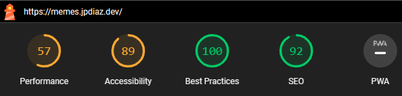

# Dev Memes - RapidAPI

A programming Memes Images using Rapid API, React, Vite and Tailwind CSS

<!-- BUILD WITH -->

### Built With 🔑

This project was developed using

<!-- CONTENT -->

## Content 🚦

This project was born as part of my effort to learn how to consume an API. In this case, how to consume Rapid API's.

[My Demo](https://memes.jpdiaz.dev/)

[Programming Memes Images](https://memes.semanticerror.com/)

## Environment Variables :rocket: Pre-Configured in Gitpod

This project's environment variables are already configured within the Gitpod workspace. You can start developing immediately.

**Note:** You do not need to manually set these variables when using Gitpod. They are automatically loaded when the workspace starts.

## How to Contribute?

All contributions are welcome. Please read the [CONTRIBUTING guidelines](CONTRIBUTING.md) for details on our code of conduct, and the process for submitting pull requests.

<!-- LICENSE -->

## License 📜

Distributed under the MIT License.

<!-- RELATED PROJECTS -->

### Lighthouse Score 🚀

## Projects 🚀

## Courses & Certifications

For more information regarding my completed courses and certificates, please click on:

<!-- ACKNOWLEDGMENTS -->

## Acknowledgments 📚

Resources list that I find helpful and would like to give credit to.

- [Rapid API](https://rapidapi.com/)
- [Rapid API - Programming Memes Images](https://rapidapi.com/kaushalsharma880-GAglnDIvTy/api/programming-memes-images)
- [Bob's Burgers API](https://bobsburgers-api.herokuapp.com/) as fallback API
- [React](https://reactjs.org/)
- [Vite](https://vitejs.dev/)
- [Tailwind CSS](https://tailwindcss.com/)
